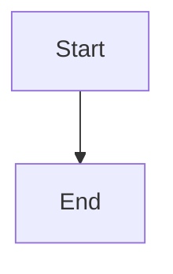

# Markdown

Markdown is especially useful in this course because many AI tools (including large language models/LLMs) format their answers in Markdown by default. That's why AI responses often include headings, bullet lists, code blocks, and links that render nicely in VS Code and on GitHub. Learning a little Markdown helps you read those responses clearly and copy useful pieces (like code blocks) without getting lost.

Markdown is a simple way to format text using plain characters (like `#`, `*`, and `-`). It’s widely used because it’s:
- easy to read in plain text
- easy to write (no special software needed)
- supported almost everywhere (GitHub, VS Code, documentation sites)

In this course, you’ll see Markdown in files like `README.md`, instructions, and notes.

## Part 1 — Quick Guide (what you’ll use most)

### Headings
```md
# Title
## Section
### Subsection
```

### Paragraphs + line breaks
- A blank line starts a new paragraph.
- A single newline usually does **not** create a line break when rendered.

```md
This is one paragraph.

This is another paragraph.
```

### Bold, italic, and code
```md
**bold**
*italic*
`inline code`
```

### Lists
Unordered list:
```md
- item
- item
  - nested item
```

Ordered list:
```md
1. first
2. second
```

### Links
```md
[link text](https://example.com)
```

### Images
```md

```

### Code blocks
Use triple backticks:

```md
```js
console.log("hello")
```
```

### Block quotes
```md
> This is a quote.
```

### Horizontal rule
```md
---
```

## Part 2 — Intermediate (very common on GitHub)

### Tables
```md
| Column A | Column B |
|---------:|:---------|
| right    | left     |
```

### Task lists (checkboxes)
```md
- [ ] not done
- [x] done
```

### Escaping characters
If you want a literal character (like `*`) instead of formatting, add a backslash:
```md
\*not italic\*
```

### Inline HTML (sometimes used)
Markdown usually allows some HTML:
```md
<details>
<summary>Click to expand</summary>

Hidden text.
</details>
```

## Part 3 — Advanced / Power features

### Reference-style links
Useful for cleaner documents:
```md
Read the [course repo][repo].

[repo]: https://github.com/ORG/REPO
```

### Footnotes (depends on platform)
Some renderers support footnotes:
```md
Here is a statement.[^1]

[^1]: Footnote text.
```

### Mermaid diagrams (GitHub supports many)
```md

```

### Alerts / callouts (platform-specific)
Some systems support special callouts. GitHub supports a form like:
```md
> [!NOTE]
> This is a note.
```

## Part 4 — Reference (what’s available)

### Text
- `**bold**`
- `*italic*`
- `` `inline code` ``

### Structure
- Headings: `#`, `##`, `###`, …
- Lists: `-` / `1.`
- Block quote: `>`
- Divider: `---`

### Content
- Links: `[text](url)`
- Images: ``
- Code blocks: triple backticks with an optional language
- Tables, task lists, details/summary

## Tips
- In VS Code: press `Cmd+Shift+V` (macOS) / `Ctrl+Shift+V` (Windows/Linux) to preview Markdown.
- Keep lines reasonably short for readability.
- When in doubt, look at other course files and copy the pattern.
